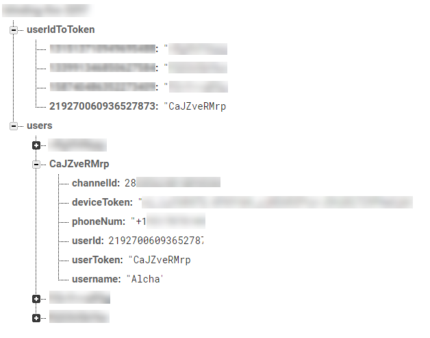

# Hermes
A Discord chat bot written in Node.js using the Eris library. My intent is to use it as a middle-man between Discord and my text messages received on my Android phone.

This is accomplished using an Android app I wrote that forwards all of my received messages to a Firebase server where Hermes watches for any changes. As soon as a new message is received, it's sent to me and I can choose to reply, delete, or snooze the text message.

## Data Stored
Since moving to Firebase Cloud Messaging, the only data stored is the users phone number, Discord user Id, the channel Id for a direct message, their device token, and their user token.
Here is a screenshot of the data stored for my test entry:

    Hermes - Hermes.
    Copyright (C) 2017  Alcha

    This program is free software: you can redistribute it and/or modify
    it under the terms of the GNU General Public License as published by
    the Free Software Foundation, either version 3 of the License, or
    (at your option) any later version.

    This program is distributed in the hope that it will be useful,
    but WITHOUT ANY WARRANTY; without even the implied warranty of
    MERCHANTABILITY or FITNESS FOR A PARTICULAR PURPOSE.  See the
    GNU General Public License for more details.